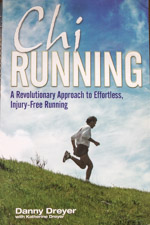
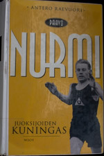
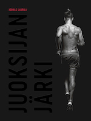
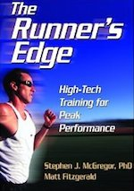

------------------------------------------------------------------------

# Juoksuaiheista luettua

#### Chi Running

###### *Dreyer, Danny (2004): Chi Running. A Revolutionary Approach to Effortless, Injury-Free Running. Pocket Books. London*

Tämä on itselleni ollut ylivoimaisesti tärkein juoksukirja. Taustaksi
sanottakoon, että ensimmäiselle maratonille treenatessa (2005) rikoin
polveni ja toiselle valmistautuessa (2008) kaikki jaloissa vaikutti
väärältä: polvet pettivät, penikat vaivasivat, tuli marssimurtumia.
Kaveri suositteli tätä kirjaa keväällä 2008, kun kerroin
hankaluuksistani. Vaikka kirjan hörhökerroin vaikutti korkealta, päätin
lukea ja onnekseni luin. Tämän jälkeen en ole juoksulla saanut paikkoja
rikki. Tai no, olen, mutta kyse ei ole ollut juoksutekniikasta.

Dreyerin ote on varsin holistinen. Taustalla on tietoisen läsnäolon
(mindfulness) ajatuksia, Pilatesta, Tai Chi'tä. Silti kirjan parasta
antia aloittelevalle juoksijalle olivat konkreettiset (sekä kuvilla että
mielikuvilla höystetyt) ohjeet juoksutekniikasta. Keskeistä on
yksinkertainen ajatus siitä, että juoksijan "kaasu" on vartalon
nojautuminen eteenpäin ja että jaloilla pitää keskittyä käyttämään isoja
lihaksia pienten sijaan. Tämän ympärille sitten kiertyy kaikkea
hengityksestä ruokavalioon ja harjoitteluohjelmiin.

Itselleni iso oivallus oli se, että hyvä juoksutekniikka ei välttämättä
löydy vain omaa itseä tutkiskelemalla ja enemmän juoksemalla. Jossain
vaiheessa tarvitaan interventioita ja tietoisia muutoksia. Vaikeinta oli
se, että juoksuvauhti aluksi hidastui muutosten myötä, joskin sitten
nopeasti pääsin entisiin vauhteihin ja nyt muutaman vuoden jälkeen
samalla tekniikalla ollaan jo eri minuuttilukemilla. Avain on ollut se,
että paikat eivät ole menneet rikki. Luulen myös, että kirjassa on vielä
paljon omaksuttavaa, kun omat vauhdit ja kunto muuttuvat parempaan
suuntaan.

#### Paavo Nurmi. Juoksijoiden kuningas.

###### *Raevuori, Antero (1997): Paavo Nurmi. Juoksijoiden kuningas. Laajennettu painos. WSOY. Helsinki*

Kirja oli erittäin mielenkiintoista mutta myös surullista luettavaa.
Nurmi ei vaikuta olleen erityisen onnellinen ihminen. Sosiaalinen
lahjattomuus vaikuttaa jopa sairaudelta enemmän kuin kasvatuksen tai
kulttuurin tuottamalta toimintamallilta.

Raevuoren kuvauksen pohjalta Nurmi piirtyy kuitenkin hapuilevana
ammattilaisena aikana, jolloin urheilu oli vielä varsin amatöörimäistä.
Nurmi opetteli kellon kanssa tuntemaan kehonsa suhteessa vauhtiin ja
tulostavoitteisiin. Hän analysoi omia ja kilpakumppanien suorituksia ja
tuntuu suhtautuneen ylipäätään korostuneen analyyttisesti harjoitteluun.
Tulokset ovat hämmentäviä (erityisesti Pariisin olympialaiset 1924:
kaksi kultaa tunnin sisällä 1500m ja 5000m juoksussa sekä lähes
epäinhimillinen maastojuoksusuoritus) ja lahjakkuus kiistatonta. Jää
mietityttämään, kuinka hurjiin suorituksiin Nurmi olisi pystynyt
nykytiedon valossa ja parempien sparrauskumppanien kanssa. Ja toisaalta,
kuinka monen onnellisen kontaktin, sattumuksen ja ihmissuhteen ohi hän
tuloskeskeisessä umpimielisyydessään kulki.

Vuosilukuja Raevuori käyttää varsinkin kirjan alussa hieman säästellen.
Kun kerronta hyppii temaattisesti eikä kronologisesti, välillä tuppaa
katoamaan taju siitä, mitä aikaa nyt oikeastaan elettiinkään. Muuten
kerronta imee hyvin mukaansa. Nurmen yksinäisyydestä ja vaikenemisesta
johtuen monet persoonaan ja hänen tuntemuksiinsa liittyvät asiat jäävät
kuitenkin ikuisiksi mysteereiksi.

#### Juoksijan järki

###### *Laurila, Joonas (2017): Juoksijan järki. No Tofu Publishing*

Tämä herätti ristiriitaisia tuntemuksia. Laurilan tarina on aika
uskomaton. Hän vetää täysin juoksuun sopimattomalla jalalla
käsittämättömiä maratonaikoja. Aloittelijana eka maraton kolmen tunnin
pintaan ja treenillä sitten alle kolmen tunnin.

Tämä kirja sopii ehkä paremmin sellaiselle, joka ei itse juokse, tai
joka osaa suhtautua tähän "vain" tarinana Laurilan jalasta ja
ongelmallisen jalan omistajan mietteistä. Ja uskomattomasta
lahjakkuudesta. Kuten Laurila itse toteaa, vain 2% ihmisistä omaa
sellaiset fyysiset ominaisuudet, joilla juostaan alle kolmen tunnin
maraton. Laurila on yksi heistä. Siksi tästä kirjasta ei ole niin paljon
iloa tavallisen harrastajan peilauspintana.

Kun on tuollainen iso ongelma, kuten Laurilan jalka, siitä tulee
helposti tarinan "päähenkilö". Olisin itse halunnut tietää vähän enemmän
Laurilasta ja juoksun nivoutumisesta osaksi elämää. Jalka on niin paha
mörkö, että kaikki muu – juoksu mukaanlukien – näyttää soljuvan helposti
ja kuin itsestään. Niin käsittämätöntä kuin se onkin, isosta ongelmasta
huolimatta homma on jotenkin vähän liian... niin... ongelmatonta. Haluan
enemmän ongelmia!

#### The Runner's Edge

###### *McGregor, Stephen & Matt Fitzgerald (2010): The Runner's Edge. High-Tech Training for Peak Performance. Human Kinetics. USA.*

Fysiologiasta väitelleen
Stephen J. McGregorin ja juoksukirjoja tehtailevan Matt Fitzgeraldin
opus on periaatteessa sykemittarin osto- ja käyttöopas. Se esittelee
mittaamisen hyödyt, keskeiset sykemittarivalmistajat ja opastaa, kuinka
käyttää mittareita harjoittelun tukena. Lisäksi kirja esittelee
Fitzgeraldin kehittämän pzi-järjestelmän (pace zone index), joka
muistuttaa Jack Danielsin VDOT-järjestelmän pohjalta laskettuja sopivia
harjoitteluvauhteja.

Kirjan vahvuutena on se, että se esittelee kuinka mittaria ja ennen
kaikkea reaaliaikaista vauhdin seurantaa voi käyttää harjoittelun
apuvälineenä ja avasi ainakin itselleni juoksuohjelman laatimisen
peruslogiikkaa tavalla, jota en valmiita ohjelmia tuijottelemalla ole
oivaltanut.

Teknologisesta ulottuvuudesta huolimatta kirjoittajat väistelevät
teknouskovaisuutta, mikä on ihan kivaa. Sen sijaan molemmilla on suora
linkki [Trainingpeaks](http://home.trainingpeaks.com)-palveluun
(McGregor on kehittänyt juoksun tehokkuutta mittaavaan rTSS-suureen
kyseiseen palveluun), jonka ostaminen alkaa vaikuttaa lähes
välttämättömältä, jos haluaa täyden hyödyn irti laitteista. Tämä turhan
kiinteä suhde yhteen brändiin vähän ärsyttää, varsinkin kun muitakin
vastaavia softia on tarjolla (esim.
[Sporttracks](http://www.zonefivesoftware.com),
[Rubitrack](http://www.rubitrack.com) tai [Golden
Cheetah](http://www.goldencheetah.org), ja pelkistetyillä
mittarivalmistajien palveluillakin pärjää). Summa summarum: halpa ja
nopealukuinen kirja, joka oli näin aloittelijana ihan ok lukea, mutta
tuskin antaa mitään vähänkään kokeneemmalle juoksijalle.

