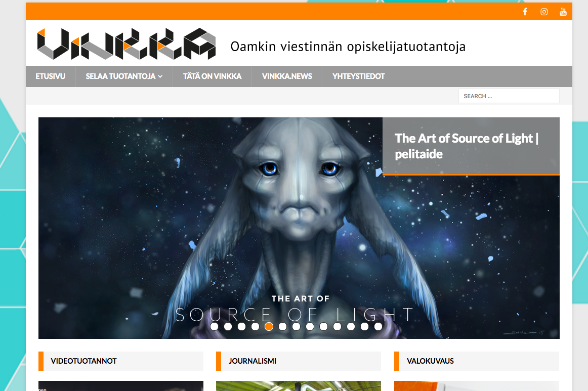

------------------------------------------------------------------------

Vuosi 2020
==========

#### [Tekstinlouhinta työpaikkailmoituksista](https://frostlab.fi/itduunit)

**Edit 02/2022: MOL on muuttanut APIaan, joten olen kytkenyt toistaiseksi
kaikki päivitykset pois. Katsotaan, jaksanko palata tämän ääreen jossain vaiheessa.**

ITDuunit-sivusto raapii päivittäin uudet it-alan työpaikat TE-keskuksen
palvelusta ja ylläpitää listaa auki olevien paikkojen edellyttämistä
osaamisista. Tällä hetkellä systeemi parsii ilmoitusteksteistä
hakijoilta edellytettyjä teknologiataitoja ja näyttää, mitä
teknologioita juuri nyt pitäisi osata. Systeemiin on kertynyt syksystä
2019 lähtien myös historiallista dataa, joten kohta tätä voisi täydentää
niin, että näytetään myös eri osaamisten trendit ajan suhteen. Lisäksi
tarkoituksena on parturoida myös muut kuin teknologiaosaamiset eli
"työelämätaidot", "ajattelun taidot" yms. omaksi osuudekseen.

**Tekniikat:** Webbisivusto: Flask ja Plotly. NLP-työkaluna NLTK. 
**Demoserveri:** [frostlab.fi/itduunit](https://frostlab.fi/itduunit)  

------------------------------------------------------------------------

#### [NLP ja tekstinlouhinta uutisaineistoista](https://frostlab.fi/nlpnews)

Tein uutisanalytiikkaa jutuista, jotka käsittelevät sekä
**Ilmastonmuutosta** että **Greta Thunbergia**. Kyseessä on sovellus,
joka raapii uutissivustoilta uutisia, puhdistaa sivut tekstiksi (ja
tarpeen tullen poistaa myös yleisimpiä sanoja ja välimerkkejä), ja
käyttää erilaisia NLP-tekniikoita uutisten analysoimiseksi. Käytössä on
yksinkertaista sanojen yleisyyden laskentaa, sentimenttianalyysiä,
nimien tunnistamista ja aihemallinnusta (LDA). Tulokset näytetään
webbisivustona. Aineisto tätä varten on kerätty projektina yhdellä ajanhetkellä
joulukuussa 2019, mutta louhinnan voisi myös laittaa päivittymään
automaattisesti.

**Tekniikat:** Web: Flask ja Plotly. Analyysityökaluina mm.
NLTK, Scikit-learn, NewsAPI, Vader jne.  
**Lähdekoodi:**: [githubissa](https://github.com/palokangas/nlpnews) 
**Demoserveri:** [frostlab.fi/nlpnews](https://frostlab.fi/nlpnews)  

------------------------------------------------------------------------

Vuosi 2019
==========

#### [Menomeno event calendar API browser](https://github.com/palokangas/eventbrowser/)

Webbisovellus, joka hyödyntää Menomeno RESTful APIa (kts. alla).
Sovelluksella voi selata tapahtumakalenterin tapahtumia eri kriteerien
mukaan. APIn kautta voi myös lisätä uusia kaupunkeja, tapahtumapaikkoja
ja tapahtumia sekä editoida vanhojen tietoja.

**Tekniikat:** ReactJS, Bootstrap 4  
**Koodi:** [Githubissa](https://github.com/palokangas/eventbrowser/)  

<iframe src="https://player.vimeo.com/video/368249640?autoplay=1&loop=1&title=0&byline=0&portrait=0"
style="position:absolute;top:0;left:0;width:100%;height:100%;"
frameborder="0" allow="autoplay; fullscreen"
allowfullscreen></iframe>

------------------------------------------------------------------------

#### [Menomeno backend & RESTful API](https://app.apiary.io/menomenoapi/)

Oulusta, ja ehkä muistakin kaupungeista, puuttuu edelleen
tapahtumakalenteri, joka pysyisi ajan tasalla. Tavoitteena on tehdä
sellainen. Projekti on vielä työn alla, mutta toimiva, testattu backend
ja dokumentoitu REST API on nyt tehty. Seuraavana täydennetään
tarvittavaa dataa ja mietitään myös frontend-puolta.

**Tekniikat:** Flask, Flask-RESTful, Python (paikallinen admin:
Javascript, JQuery)  
**Koodi:** [Githubissa](https://github.com/palokangas/menomeno/)  
**API dokumentaatio:**
[Apiaryssä](https://app.apiary.io/menomenoapi/)

------------------------------------------------------------------------

#### Uutistutka 

Oulun yliopiston projektissa tekemäni tiedonlouhintasovellus, jossa
analysoidaan verkon ilmastonmuutosuutisia. Uutiset haetaan avoimien
rajapintojen kautta, puhdistetaan tekstiksi, analysoidaan eri
tekniikoita käyttäen ja raportoidaan webbiin. Käyttöliittymäpuolella on
nyt valmiina sanafrekvensseihin pohjaava analyysityökalu ja sen
raportointi. Bubbling under kaikkea muuta.

**Tekniikat:** Django, Python, NLTK, PostgreSQL, Nginx  
**Verkossa:** -- poistettu julkisesta verkosta 19.12.2021 --

------------------------------------------------------------------------

#### ArticleWeb

Oulun yliopiston projektissa tekemäni tiedonlouhintasovellus, jossa
puretaan tietellisistä artikkeleista lähdeviitetietoja ja analysoidaan,
kuka viittaa kehenkin, mihin journaaleihin ja milloin. Tämän osaksi
kehitelty myös
[articleparse](https://github.com/palokangas/article-parse)-työkalua,
jolla saataisiin pdf-tiedostot purettua järkevästi analysoitavaksi
tekstiksi (osoittautunut haasteelliseksi, koska PDF on todellakin
layout-formaatti eikä sen rakenteesta ole mitään takeita. Toimii
kuitenkin suhteellisen varmasti yksi- ja kaksipalstaisille julkaisuille
ja monille lähdeviiteformaateille).

**Tekniikat:** Django, Python, PostgreSQL, Nginx,
[articleparse](https://github.com/palokangas/article-parse)  
**Verkossa:** -- poistettu julkisesta verkosta 19.12.2021 --

------------------------------------------------------------------------

Vuosi 2017
==========

#### [Hypernote Beast](https://github.com/palokangas/beast/)

Käyttöliittymäohjelmoinnin kurssille tehty työ, jossa testasin, miten
tehdä käyttöliittymältään mahdollisimman pieni muistiinpano-ohjelma,
joka muuttuisi "isoksi" ohjelmaksi hyperteksti-ominaisuuksien avulla.

**Tekniikat:** Java, Swing  
**Koodi:** [githubissa](https://github.com/palokangas/beast/)

------------------------------------------------------------------------

Vuosi 2015
==========

#### [Vinkkamedia](http://vinkkamedia.fi)

Vastasin portfoliosivun teknisestä toteutuksesta ja
projektinhallinnasta sekä ylläpidosta 2015-2020. Graafinen ilme on
henkilökunnan ja opiskelijoiden yhteistyötä. Toteutus
Wordpress-pohjalle.

------------------------------------------------------------------------

#### [Vinkka.news](http://vinkka.news)

Vinkka.newsin suunnittelu- ja ylläpitotehtävät vuodesta 2008 vuoteen 2020. Nykyinen
on jo aika mones versio alkuperäisestä. Wordpressistä lähdettiin
liikkeelle, josta Drupalin ja Joomlan testailujen kautta takaisin
Wordpressiin. Palvelun vaatimuksena on, että sen pitää olla järkevästi
ylläpidettävä, taipua moniin julkaisutarkoituksiin (mm. radio- ja
podcast-projektien julkaisu) sekä olla opiskelijoille ja henkilökunnalle
helposti opittava. Pohjalla Wordpress. Logo ja graafinen ilme
henkilökunnan ja opiskelijoiden yhteistyötä.

------------------------------------------------------------------------

Vuosi n. 1993-1994
==================

#### PC-Atoms

Pelasin teini-ikäisenä kaverin Amiga 500 -koneella kovaa peliä nimeltä
Atoms. Itsellä oli vain PC ja peliä ei ollut saatavilla PC:lle, joten
tein sen itse. Ei kovin kaunis, mutta toimiva ja ihan ok strategiapeli,
jota tuli tahkottua kaveria vastaan aika tavalla. Alkuperäinen toteutus
oli Turbo Pascalilla ja jollain sille julkaistulla grafiikkakirjastolla.
Toimii DOS-ympäristössä ja edelleen emulaattorin kautta. Lähdekoodit
ovat kadonneet, joka ei välttämättä ole valitettava asia. Tämä olisi
mukava toteuttaa uudestaan ja pistää mukaan tekoäly.

#### Muuta mainittavaa

-   [VDR](http://tvdr.de)-pohjaisia linux-digibokseja olen rakentanut
    omiin ja muiden tarpeisiin. Näissä on opittu paljon linuxeista,
    sarjaporteista, tv-virittimistä, bash-skriptauksesta,
    saksankielisistä teknisistä ohjeistuksista, avoimen lähdekoodin
    olemuksesta ja DVB-tekstitykseen liittyvän idealismin ongelmista.
-   Omat Python-projektit pyörivät
    Ubuntu-virtuaaliservereillä Vultrissa. AWSää testattu myös, mutta
    Vultr osoittautui omiin tarpeisiin yksinkertaisemmaksi ja
    riittäväksi. NLP-analyysiprojekti pyörii halvassa
    webhotellissa (kohtuullisesti!) Apache WSGI-modia hyödyntäen.
-   Wordpress-projektit ovat PHP-webhotelleissa. Nykyisin Godaddyssä.
-   Linux-taidot ovat kohtuullisen hyvät. Tutuimmat Linuxit
    ovat Debian-pohjaisia.

