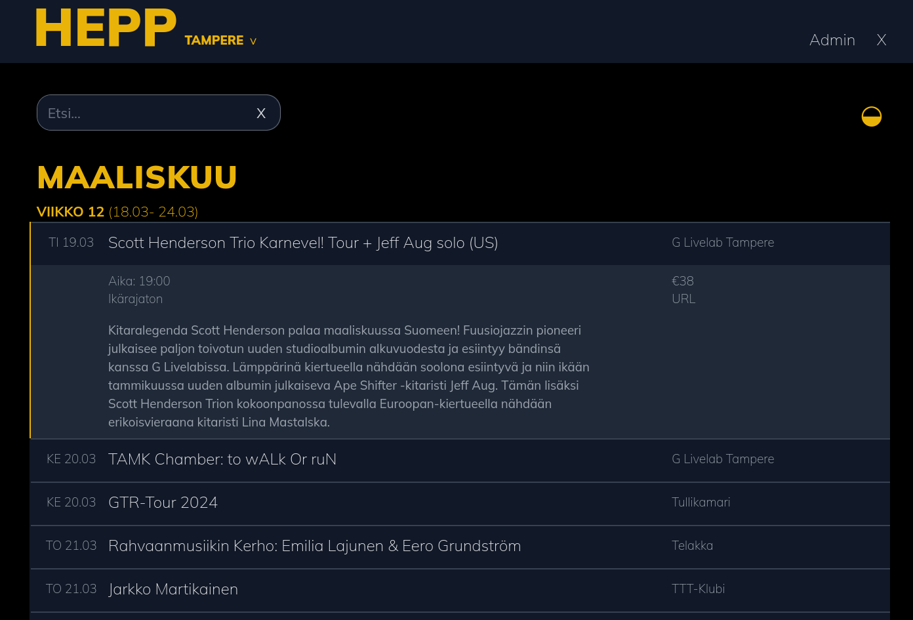
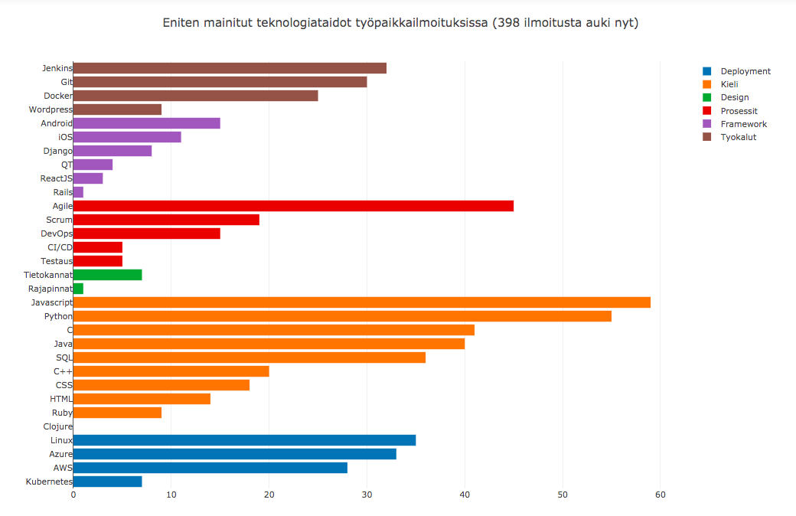
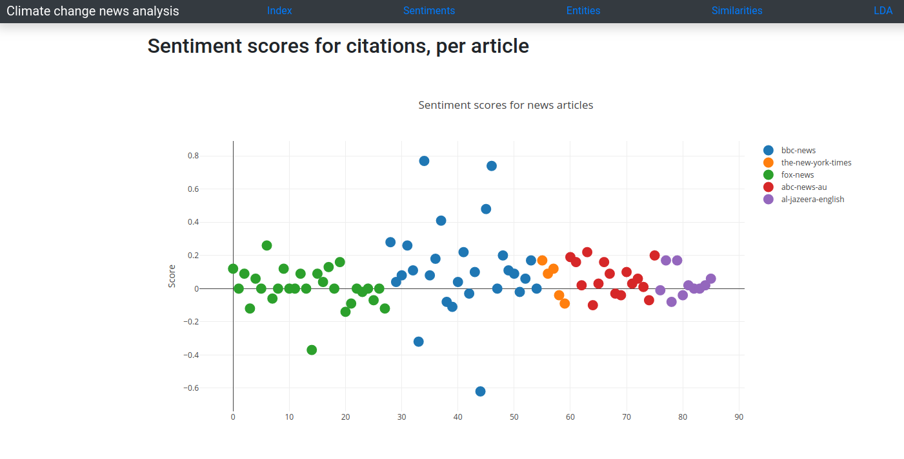
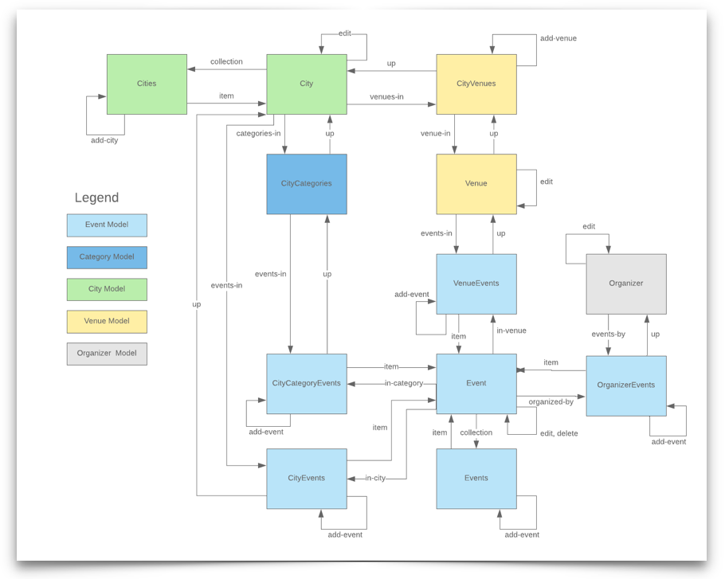
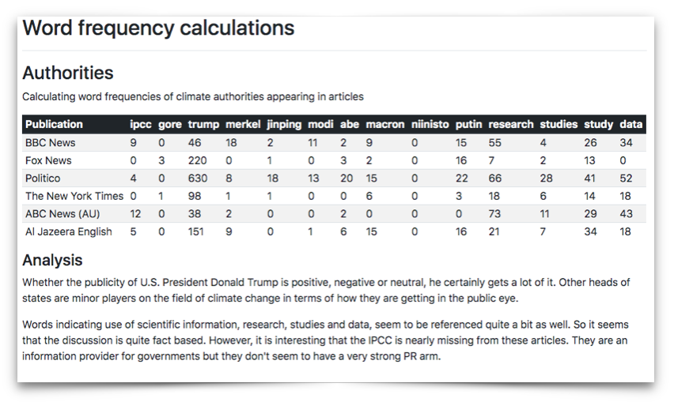
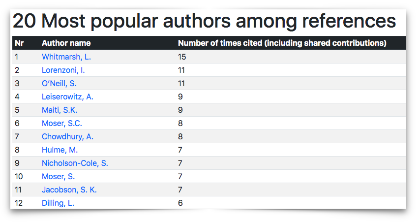
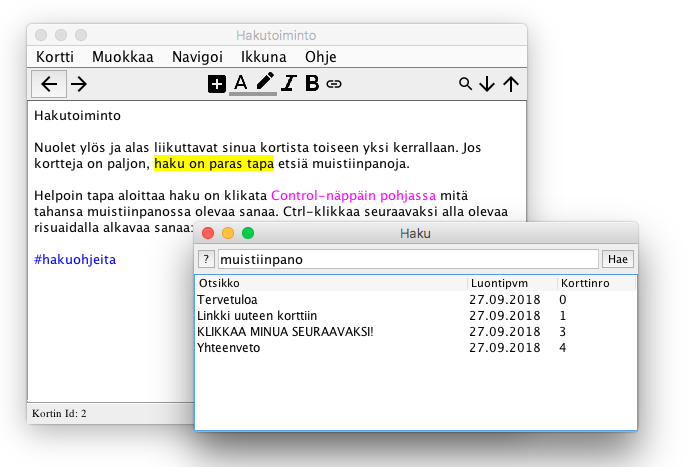
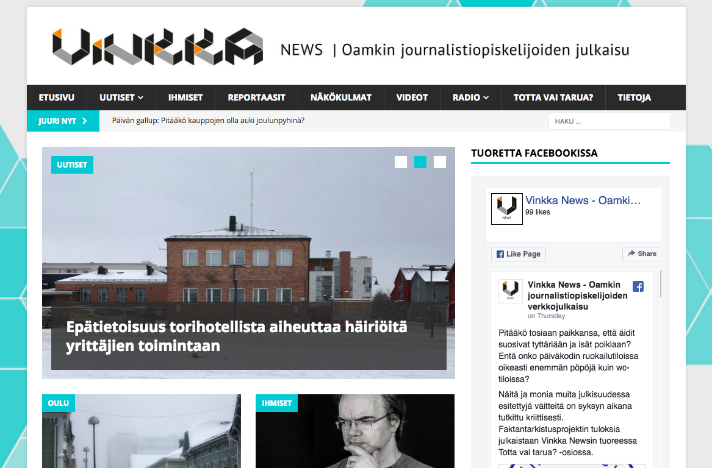
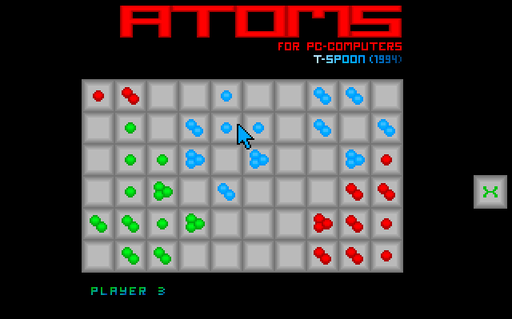

------------------------------------------------------------------------

Vuosi 2023-
===========

#### [Hepp-keikkakalenteri](https://hepp.fi)

Hepp on keikkakalenteri, joka hakee Tampereen - ja rajoitetummin Oulun -
live-musiikkitapahtumat keikkapaikkojen sivuilta, tuo ne moderoitavaksi ja
muokattavaksi ja julkaisee keikat. Kalenterilla on suunnnitteluperiaate:
- Kaikki kaupungin keikat esitetään yhtenä pitkänä listana, josta voi hakea. Ei sivutusta tai klikkailun tarvetta.
- Kaikessa suunnittelussa ensisijaistetaan se, että käyttäjä saisi tarpeellisen
informaation mahdollisimman nopeasti.

Käyttäjäosio beta-vaiheessa testiryhmällä: mahdollisuus seurata keikkoja,
tapahtumapaikkoja, toimia tapahtumajärjestäjänä ja julkaista tapahtumia,
tilata sähköpostimuistutuksia yms. Jos haluat testikäyttäjäksi, ota yhteyttä!

**Tekniikat:** Ruby on Rails, PostgreSQL, Sidekiq, Redis, Puppeteer, Dokku yms.

Vuosi 2020
==========

#### [Queenifier](https://open.spotify.com/playlist/0nYk598AxbNWBYNDQO7Y73?go=1&sp_cid=be8b9a9f67264848ae4fe07cb0d18dfe&nd=1&dlsi=e70f31e113394ef1)

Queenifier on erittäin tärkeä botti. Se raapii Spotifystä kaikkien Queenin biisien suosion
ja muodostaa niistä kerran vuorokaudessa päivittyvän Greatest Hits -kokoelman, kuitenkin niin,
että yksikään listalla oleva biisi ei ole sama kuin Greatest Hits 1, 2 tai 3 -albumeilla.

Kuriositeetti: Queenillä on Spotifyssä 1637 biisi-versiota, mutta "vain" 257 eri biisiä. Joten
listallakaan ei tule olla saman biisin eri versioita (ainakin Love of My Life olisi muuten monta kertaa).

**Tekniikat:** Python & Spotify API

<figure class="image is-1by1">
  <iframe class="has-ratio" width="600" height="800" src="https://open.spotify.com/embed/playlist/0nYk598AxbNWBYNDQO7Y73" frameborder="0" allowfullscreen></iframe>
</figure>

 

------------------------------------------------------------------------

#### [Tekstinlouhinta työpaikkailmoituksista](https://frostlab.fi/itduunit)

**Edit 02/2022: MOL on muuttanut APIaan, joten olen kytkenyt toistaiseksi
kaikki päivitykset pois**

ITDuunit-sivusto hakee päivittäin uudet it-alan työpaikat TE-keskuksen
palvelusta ja ylläpitää listaa auki olevien paikkojen edellyttämistä
osaamisista. Tällä hetkellä systeemi parsii ilmoitusteksteistä
hakijoilta edellytettyjä teknologiataitoja ja näyttää, mitä
teknologioita juuri nyt pitäisi osata. 

**Tekniikat:** Webbisivusto: Flask ja Plotly. NLP-työkaluna NLTK. 

------------------------------------------------------------------------

#### [NLP ja tekstinlouhinta uutisaineistoista](http://frostlab.fi/nlpnews)

Tein uutisanalytiikkaa jutuista, jotka käsittelevät sekä
**Ilmastonmuutosta** että **Greta Thunbergia**. Kyseessä on sovellus,
joka raapii uutissivustoilta uutisia, puhdistaa ne ja
käyttää erilaisia NLP-tekniikoita uutisten analysoimiseksi. Käytössä on
yksinkertaista sanojen yleisyyden laskentaa, sentimenttianalyysiä,
nimien tunnistamista ja aihemallinnusta (LDA).

**Tekniikat:** Web: Flask ja Plotly. Analyysityökaluina mm.
NLTK, Scikit-learn, NewsAPI, Vader jne.  
**Lähdekoodi:**: [githubissa](https://github.com/palokangas/nlpnews) 
**Projektisivu:** [frostlab.fi/nlpnews](http://frostlab.fi/nlpnews)  

------------------------------------------------------------------------

Vuosi 2019
==========

#### [Menomeno event calendar API browser](https://github.com/palokangas/eventbrowser/)

Webbisovellus, joka hyödyntää Menomeno RESTful APIa (kts. alla).

**Tekniikat:** ReactJS, Bootstrap 4  
**Koodi:** [Githubissa](https://github.com/palokangas/eventbrowser/)  

<iframe src="https://player.vimeo.com/video/368249640?autoplay=1&loop=1&title=0&byline=0&portrait=0"
style="position:absolute;top:0;left:0;width:100%;height:100%;"
frameborder="0" allow="autoplay; fullscreen"
allowfullscreen></iframe>

------------------------------------------------------------------------

#### [Menomeno backend & RESTful API](https://app.apiary.io/menomenoapi/)

Oulusta, ja ehkä muistakin kaupungeista, puuttuu edelleen
tapahtumakalenteri, joka pysyisi ajan tasalla. Tavoitteena on tehdä
sellainen. Projekti on vielä työn alla, mutta toimiva, testattu backend
ja dokumentoitu REST API on nyt tehty. 

**Tekniikat:** Flask, Flask-RESTful, Python (paikallinen admin:
Javascript, JQuery)  
**Koodi:** [Githubissa](https://github.com/palokangas/menomeno/)  
**API dokumentaatio:**
[Apiaryssä](https://app.apiary.io/menomenoapi/)

------------------------------------------------------------------------

#### Uutistutka 

Oulun yliopiston projektissa tekemäni tiedonlouhintasovellus, jossa
analysoidaan verkon ilmastonmuutosuutisia. Uutiset haetaan avoimien
rajapintojen kautta, puhdistetaan tekstiksi, analysoidaan eri
tekniikoita käyttäen ja raportoidaan webbiin.

**Tekniikat:** Django, Python, NLTK, PostgreSQL, Nginx  
**Verkossa:** -- poistettu julkisesta verkosta 19.12.2021 --

------------------------------------------------------------------------

#### ArticleWeb

Oulun yliopiston projektissa tekemäni tiedonlouhintasovellus, jossa
puretaan tietellisistä artikkeleista lähdeviitetietoja ja analysoidaan,
kuka viittaa kehenkin, mihin journaaleihin ja milloin. Tämän osaksi
kehitelty myös
[articleparse](https://github.com/palokangas/article-parse)-työkalua,
jolla saataisiin pdf-tiedostot purettua järkevästi analysoitavaksi tekstiksi.

**Tekniikat:** Django, Python, PostgreSQL, Nginx,
[articleparse](https://github.com/palokangas/article-parse)  
**Verkossa:** -- poistettu julkisesta verkosta 19.12.2021 --

------------------------------------------------------------------------

Vuosi 2017
==========

#### [Hypernote Beast](https://github.com/palokangas/beast/)

Käyttöliittymäohjelmoinnin kurssille tehty työ, jossa testasin, miten
tehdä käyttöliittymältään mahdollisimman pieni muistiinpano-ohjelma,
joka muuttuisi "isoksi" ohjelmaksi hyperteksti-ominaisuuksien avulla.

**Tekniikat:** Java, Swing  
**Koodi:** [githubissa](https://github.com/palokangas/beast/)

------------------------------------------------------------------------

#### [Vinkka.news](http://vinkka.news)

Vinkka.newsin suunnittelu- ja ylläpitotehtävät vuodesta 2008 vuoteen 2020. Nykyinen
on jo aika mones versio alkuperäisestä. Wordpressistä lähdettiin
liikkeelle, josta Drupalin ja Joomlan testailujen kautta takaisin
Wordpressiin. Palvelun vaatimuksena on, että sen pitää olla järkevästi
ylläpidettävä, taipua moniin julkaisutarkoituksiin (mm. radio- ja
podcast-projektien julkaisu) sekä olla opiskelijoille ja henkilökunnalle
helposti opittava. Pohjalla Wordpress. Logo ja graafinen ilme
henkilökunnan ja opiskelijoiden yhteistyötä.

------------------------------------------------------------------------

Vuosi n. 1993-1994
==================

#### PC-Atoms

Pelasin teini-ikäisenä kaverin Amiga 500 -koneella kovaa peliä nimeltä
Atoms. Itsellä oli vain PC ja peliä ei ollut saatavilla PC:lle, joten
tein sen itse. Ei kovin kaunis, mutta toimiva ja ihan ok strategiapeli,
jota tuli tahkottua kaveria vastaan aika tavalla. Alkuperäinen toteutus
oli Turbo Pascalilla ja jollain sille julkaistulla grafiikkakirjastolla.
Toimii DOS-ympäristössä ja edelleen emulaattorin kautta. Lähdekoodit
ovat kadonneet, joka ei välttämättä ole valitettava asia. 

#### Muuta mainittavaa

-   [VDR](http://tvdr.de)-pohjaisia linux-digibokseja olen rakentanut
    omiin ja muiden tarpeisiin. Näissä on opittu paljon linuxeista,
    sarjaporteista, tv-virittimistä, bash-skriptauksesta,
    saksankielisistä teknisistä ohjeistuksista, avoimen lähdekoodin
    olemuksesta ja DVB-tekstitykseen liittyvän idealismin ongelmista.
-   Omat Python-projektit pyörivät
    Ubuntu-virtuaaliservereillä Vultrissa. AWSää testattu myös, mutta
    Vultr osoittautui omiin tarpeisiin yksinkertaisemmaksi ja
    riittäväksi. NLP-analyysiprojekti pyörii halvassa
    webhotellissa (kohtuullisesti!) Apache WSGI-modia hyödyntäen.
-   Wordpress-projektit ovat PHP-webhotelleissa. 
-   Linux-taidot ovat kohtuullisen hyvät. Tutuimmat Linuxit
    ovat Debian-pohjaisia.

